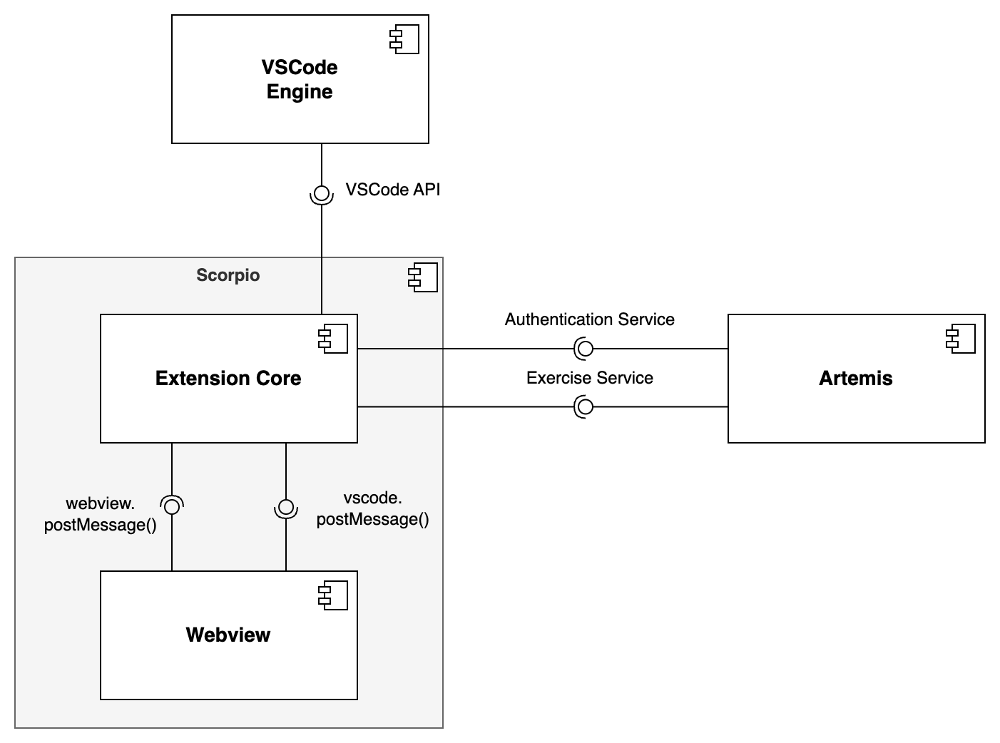
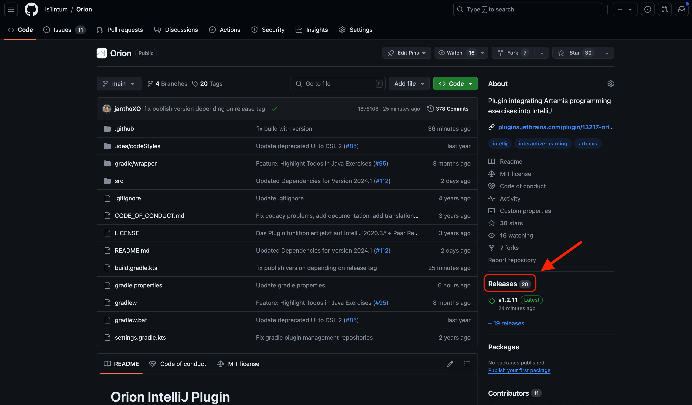
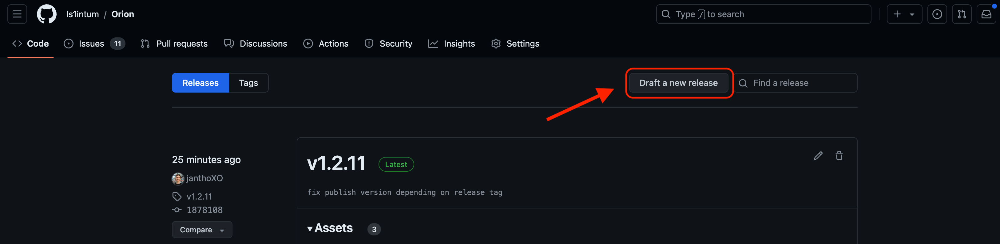
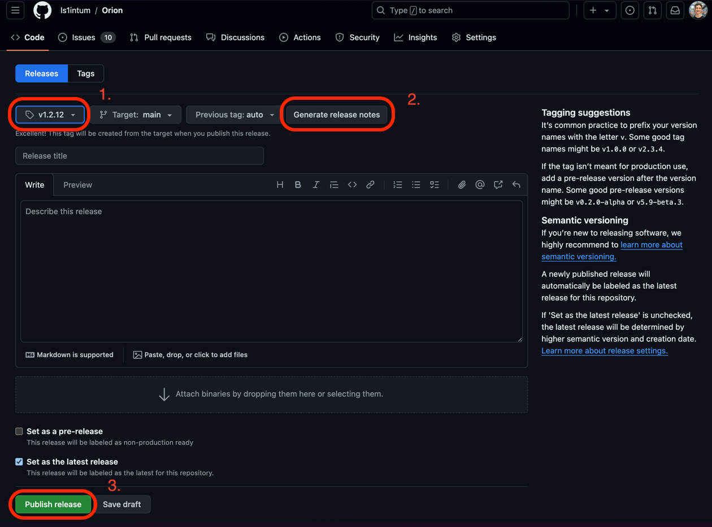

# Development

## Setup
Navigate into any of the repositories files and press

<kbd>F5</kbd> (<kbd>fn + F5</kbd> on Mac) 

to start the extension. This will open a new instance of VSCode with the extension loaded. \
Behind the scenes, this shortcut runs the default task in [./vscode/tasks.json](.vscode/tasks.json) 
```bash
npm build
``` 
(`npm run build:webview && npm run build:extension`). This builds the extension and the webview. \
If you only make changes to the **extension**, it might be faster to set this to 
```bash
npm run build:extension
```
to only build the extension. 


## Architecture
_The following diagram shows the architecture **WITH** implementation details. This is not a formal UML diagram, but should give you an overview of the architecture and the communication between components._



The extension is composed of two main components. The **extension core** and the **webview**. The extension core acts as a proxy to the VSCode Engine and Artemis. The webview mainly has the purpose of displaying UI in the sidebar. The following further differentiate the purpose of each component

### Core 
- running in a **node.js** environment
- communicates with the VSCode engine to handle the extension **lifecycle**, extension **settings**, extension **commands**
- communicates with the Artemis server to **authenticate**, **fetch and send data**
- holds the extensions **state**

The core is responsible for interacting with the VSCode engine. It handles basic extension functionality like settings, commands used by `CMD + SHIFT + P` and the extension lifecycle (activation and deactivation). The most important part of this functionality can be found in [src/extension.ts](src/extension.ts). \
The core also handles the communication with the Artemis server. It is responsible for authenticating the user, fetching and sending exercise data to the server. \
The webview can NOT communicate with the Artemis API directly due to CORS. Therefore all communication has to go through the core which acts as a proxy.


### Webview
- running in a **browser environment** and hosting its own website
- built with **Angular** and support shared components with the Artemis webapp
- **communicates with the core via `postMessage`** calls (all possible commands are defined in the [shared/webview-commands.ts](shared/webview-commands.ts) file)

The webview is built with Angular to support shared components with the Artemis webapp. Examples how to use Angular in a VSCode webview can be found here: \
[https://github.com/4gray/vscode-webview-angular/tree/master](https://github.com/4gray/vscode-webview-angular/tree/master) \
[https://github.com/microsoft/vscode-webview-ui-toolkit-samples/tree/main/frameworks/hello-world-angular](https://github.com/microsoft/vscode-webview-ui-toolkit-samples/tree/main/frameworks/hello-world-angular) \
This allows us to use the same components in both the webapp and the extension. For now sharable components are implemented separately in each repository. The goal is to merge them both into the Artemis repository in the future. \
As the webview is running in a browser environment by hosting its own website, it is only possible to embed the webapp within an iframe. With that the extension falls under the CORS policy, preventing the webview from accessing the website properly. Use of the Artemis sameSite=Lax cookie is not possible (This can be also experienced in the VSCode integrated SimpleBroswer).


## Release a new version

The release workflow is similar to the one of the Orion plugin. Therefore don't be confused by the different names in the images. The release process is as follows:



1. Go to the GitHub `Releases` in the `scorpio` repository
2. Click on `Draft a new release`

   

3. Choose as a tag the new version number to release (e.g. tag version `v1.5.0` releases the version `1.5.0`)
4. Let the release notes be auto-generated by clicking `Generate release notes`

   

5. An admin now has to review and accept the new release
6. After the release is approved, GitHub will automatically build and upload the artifact as well as publish the new version to the marketplace.

The latest plugin artifact is now available on GitHub and via the VS Code marketplace. 

**It might take some time for the latest version to be seen on the marketplace since VS Code still has to review 
and approve the changes!**

